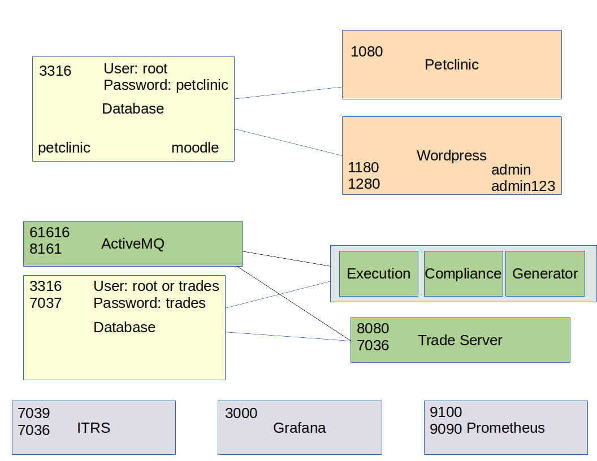

# Monitoring Environment

This project has 2 environments that can be monitored:

* [Petclinic/Moodle](containers/README.md)
* [Trading application](tradeapp/README.md)

Both environments come with Prometheus and Grafana.
ITRS is also available, but you will require your own license for the server.  You will need to use the following detail to register your license:

* hostid = 1fac2b17
* hostname = b4abc4b146ad

If you wish to change these values you'll need to edit the **Dockerfile.ubuntu** in the **itrs** directory.

The license file for ITRS needs to be stored in the ITRSLic directory, so that when you run the **docker-compose** command it will map that directory into the container.  The file must be named **gateway.lic**, and this applies to both projects.

Alternatively comment out the **itrs** service in the **docker-compose.yaml** files.

## Infrastructure diagram of both environments

