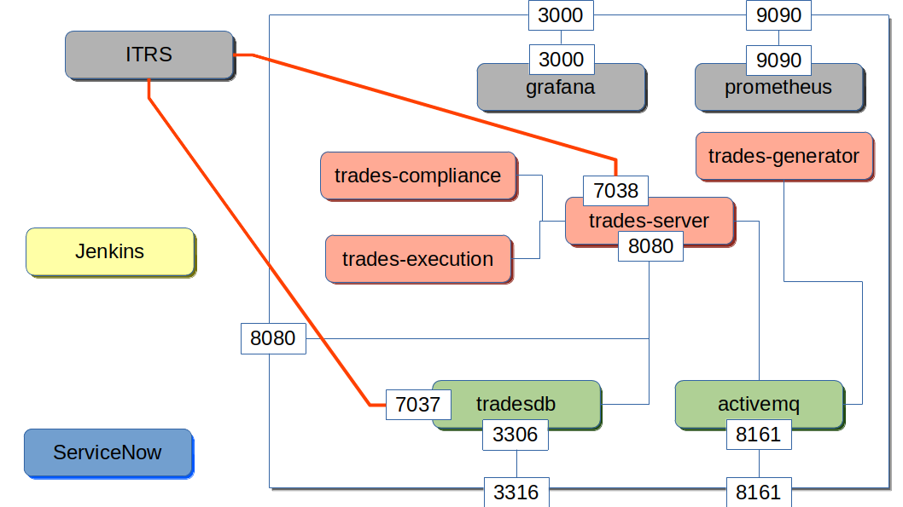

# Trading Application Environment

This application environment contains a simulated trading application.

The [Developer Readme](DevReadme.md).

## Build and run

This is a Docker Compose project, so simply run:

```
docker-compose up -d
```

# Architecture



# Container deployment and management

This will build containers and launch them.

## Build and run the environment

You can build and run the environment in one go with:

```
docker-compose up -d
```

If you do not want any particular services you should comment the service section in the docker-compose.yml file.

## To build all containers

If you have made any changes to the containers, be it the Dockerfiles, or other files you can rebuild using:

```
docker-compose build
```

**NOTE:** You can add the service name as an argument to build just to build a single container image.

Then to launch the updated containers run:

```
docker-compose up -d
```

This will only launch any changed containers.

## Prometheus blackbox HTTP test metrics

There is a blackbox HTTP container in the docker-compose.yml file that will allow for HTTP checks.  There is a configuration in prometheus.yml to cover the trades-server home page and status page.

To test the blackbox exporter container exec on to prometheus.  Run the following to check wordpress:

```
curl 'blackbox:9115/probe?target=wordpress:8001/wp-login.php&module=http_2xx'
```

# Adding Docker metrics to Prometheus

To have your Docker daemon monitored by Prometheus you will need to configure your Docker system's /etc/docker/daemon.json with the following;

```
{
  "metrics-addr": "127.0.0.1:9323",
  "experimental": true
}
```

Change **127.0.0.1** for the actual IP of your host that is running the Docker daemon.

In your prometheus.yaml configuration you will need to add the following scraper;
```
scrape_configs:
  - job_name: 'docker'
    static_configs:
      - targets: ['127.0.0.1:9323']
```

Changing **127.0.0.1** to the IP address of your Docker server.